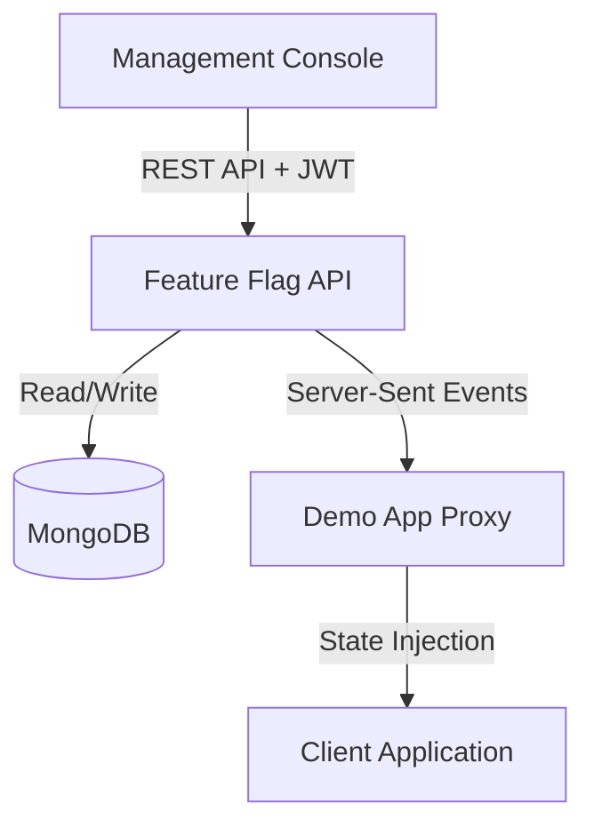

# 🚀 Enterprise Feature Flag Control Plane

[]()
[]()
[]()
[]()

A robust, full-stack feature toggle management system designed to empower development and product teams. Safely release, manage, and test features in real-time, facilitating continuous delivery and progressive rollouts without code deployments.

---

## 📑 Table of Contents
- [Architecture Overview](#-architecture-overview)
- [System Components](#-system-components)
- [Prerequisites](#-prerequisites)
- [Local Development Environment](#-local-development-environment)
- [Environment Variables](#-environment-variables)
- [Deployment Strategy](#-deployment-strategy)
- [Security Guidelines](#-security-guidelines)

---

## 🏗 Architecture Overview

The system operates on a highly decoupled architecture, ensuring scalability and strict separation of concerns between the control plane, management interface, and consuming client applications.



---

## 🧩 System Components

### 1. Control Plane (`feature-flag-api`)
The highly concurrent backend service responsible for managing state and evaluating rollout logic.
- **Technologies:** Node.js, Express, MongoDB, Server-Sent Events (SSE).
- **Features:** 
  - Real-time flag streaming via SSE.
  - Deterministic bucketing for percentage-based rollouts.
  - Secure JWT-based administrative authentication.

### 2. Management Console (`feature-flag-ui`)
A modern, responsive administrative dashboard for managing the lifecycle of feature flags.
- **Technologies:** React, Vite, Framer Motion.
- **Features:**
  - Intuitive UI for toggling features and adjusting rollout percentages.
  - Real-time environment and connection health monitoring.

### 3. Consumer Application (`feature-flag-demo`)
A fully functional reference implementation (Notes Application) demonstrating real-time feature flag integration.
- **Technologies:** Vanilla JS, Node.js Proxy.
- **Features:**
  - Dynamic, zero-refresh UI updates.
  - Secure proxy tier preventing API key exposure to the browser client.

---

## ⚙️ Prerequisites

Ensure your local development environment meets the following requirements:
- **Node.js** (v18.0.0 or higher)
- **npm** (v9.0.0 or higher)
- **MongoDB** (Local instance running on `localhost:27017` or Atlas cluster)

---

## 💻 Local Development Environment

To instantiate the system locally, run the following commands in three distinct terminal sessions from the project root.

### 1. Initialize the API
```bash
cd feature-flag-api
npm install
npm run dev
```
*Service bound to `http://localhost:5005`*

### 2. Initialize the Management Console
```bash
cd feature-flag-ui
npm install
npm run dev
```
*Service bound to `http://localhost:5173`*

### 3. Initialize the Consumer Application
```bash
cd feature-flag-demo/proxy
npm install
npm start
```
*Service bound to `http://localhost:3001`*

---

## 🔐 Environment Variables

Proper configuration is required for both local and production environments. Provide a `.env` file at the root of the respective component directories.

| Component | Variable | Description |
|-----------|----------|-------------|
| **API** | `MONGO_URI` | Connection string for MongoDB |
| **API** | `JWT_SECRET` | Cryptographic secret for signing auth tokens |
| **API** | `CONSUMER_API_KEY` | Dedicated authentication key for the Demo App |
| **API** | `ALLOWED_ORIGINS` | CORS whitelist (e.g., `http://localhost:5173`) |
| **UI** | `VITE_API_URL` | Base URI of the backend API |
| **Demo** | `API_URL` | Base URI of the backend API for the proxy target |
| **Demo** | `CONSUMER_API_KEY` | Exact match of the API's consumer key |

---

## 🌍 Deployment Strategy

Deploying the system requires a multi-tiered approach utilizing Platform-as-a-Service (PaaS) providers.

1. **Database Tier (MongoDB Atlas):**
   - Provision a managed cluster.
   - Configure IP Access Lists (`0.0.0.0/0`) for broad accessibility or restrict to known PaaS IPs.

2. **Backend API (Render / Railway):**
   - Deploy as a Node Web Service.
   - Configure the environment variables outlined above, setting `NODE_ENV=production`.

3. **Management Console (Vercel / Netlify):**
   - Deploy as a static site.
   - Build command: `npm run build` | Output dir: `dist`.
   - Inject `VITE_API_URL` pointing to the live Backend API.

4. **Consumer Application (Render / Railway):**
   - Deploy the Node.js proxy directory (`feature-flag-demo/proxy`).
   - Inject `API_URL` and `CONSUMER_API_KEY`.

---

## 🛡 Security Guidelines

- **Never** commit `.env` files to version control.
- Ensure the `CONSUMER_API_KEY` is a cryptographically strong random string.
- In production, strictly define `ALLOWED_ORIGINS` in the API to solely whitelist your specific frontend domains to prevent unauthorized CORS requests.
